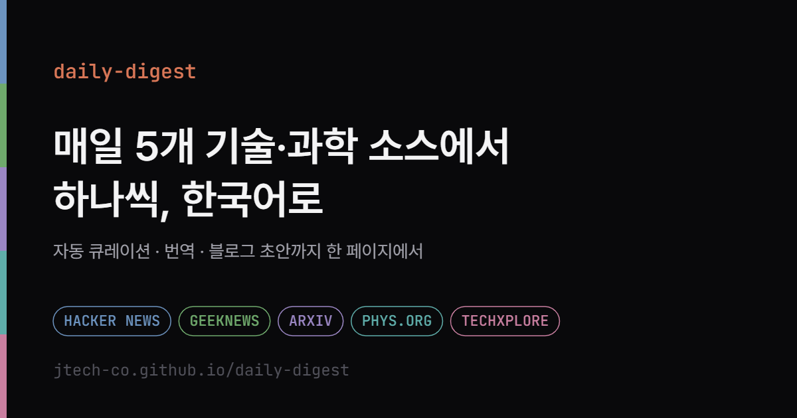

# daily-digest

> **매일 5개 기술·과학 소스에서 가장 주목할 글을 하나씩 골라 한국어로 읽는 데일리 다이제스트**

[](https://jtech-co.github.io/daily-digest/)

**사이트** https://jtech-co.github.io/daily-digest/
· **구독** [Atom](https://jtech-co.github.io/daily-digest/feed.xml) · [JSON Feed](https://jtech-co.github.io/daily-digest/feed.json)

## 1. 소개 (Introduction)

Hacker News · GeekNews · arXiv · Phys.org · TechXplore를 매일 일일이 훑기는 번거롭습니다.
**daily-digest**는 이 다섯 소스에서 **하루 소스당 1건**씩 가장 인기 있고 새로운 글을 자동으로 골라
**한국어로 번역·정리**해 한 페이지로 보여줍니다. 매일 09:00 KST에 파이프라인이 돌고 결과는 정적
사이트로 배포되므로, 읽는 쪽에서 할 일은 [페이지](https://jtech-co.github.io/daily-digest/)를 여는 것뿐입니다.

### 어디에 쓰나

하루치가 **5건으로 고정**이라 몇 분이면 훑고 넘어갈 분량이 매일 쌓입니다.

- **아침 기술 동향 브리핑**: 다섯 소스를 각각 열지 않고 한 페이지에서 끝냅니다.
- **영어 소스 진입 장벽 낮추기**: arXiv 초록과 해외 기사를 한국어로 먼저 읽고, 볼 만하면 원문으로 갑니다.
- **기술 블로그·뉴스레터 글감**: 카드를 누르면 **원문 번역본 · 핵심 요약 · 블로그 초안** 3구성이 열립니다.
- **팀 공유·리더 구독**: `feed.xml`(Atom)·`feed.json`(JSON Feed)을 매일 발행해 RSS 리더나 Slack에 바로 겁니다.
- **개인 아카이브**: 날짜별로 쌓인 기록을 원문·번역 양쪽으로 검색하고 소스 칩으로 좁혀 봅니다.
- **직접 운영**: 포크해서 소스·LLM 프로바이더를 바꿔 자기만의 다이제스트로 돌립니다.

### 어떻게 고르나

5개 소스 병렬 수집 → 4단계 중복 제거 → 소스당 1건 선별(빈 소스는 다른 소스에서 보충). 한 소스가 죽어도
나머지는 그대로 올라오고, 과거에 실린 항목은 다시 뽑지 않습니다. LLM 키는 선택이며(없으면 원문 그대로 게시)
Anthropic · OpenAI · Grok(xAI) · Gemini를 지원합니다. 사이트 우측 상단 ⚙에서 본인 키로 직접 생성(BYOK)할 수도 있습니다.

## 2. 기술 스택 (Tech Stack)

- **Frontend**: Vanilla JS (ES Modules) · CSS (프레임워크·빌드 단계 없음)
- **Pipeline**: Node.js 22+ (ESM), 외부 의존성은 `rss-parser` 하나뿐
- **Database**: SQLite (Node 내장 `node:sqlite`, 단일 파일)
- **Automation**: GitHub Actions (cron) · GitHub Pages

## 3. 설치 및 실행 (Quick Start)

**요구 사항**: Node.js 22 이상

```bash
git clone https://github.com/JTech-CO/daily-digest.git
cd daily-digest
npm install
```

LLM 키를 쓰려면 `.env.example`을 `.env`로 복사해 하나 이상 채웁니다(생략 가능).

```bash
npm start        # 수집 → 중복제거 → 선별/재분배 → 번역 → SQLite 적재
npm run build    # DB → 정적 사이트(public/) 생성
npm run serve    # 로컬 미리보기 → http://localhost:4173
```

그 밖에 `npm test`(테스트) · `npm run monitor`(엔드포인트 헬스체크) ·
`npm run backfill -- --limit=20`(과거 항목 소급 번역, LLM 키 필요) ·
`npm run repair:html -- --dry`(저장된 본문의 HTML 마크업 점검).

`npm start`는 실행 후 인베리언트를 검사해 게시 건수 부족이나 "키가 있는데 번역 0건" 같은
무증상 실패를 비-0 종료로 드러냅니다.

> **배포**: GitHub Pages를 켜면 `daily.yml`이 매일 09:00 KST에 수집부터 돌려 사이트를 갱신하고,
> `web/`·`images/`·`src/web/`를 고쳐 푸시하면 `deploy.yml`이 수집 없이 화면만 바로 배포합니다.
> LLM 키는 리포지토리 Secret으로 주입합니다.

## 4. 폴더 구조 (Structure)

```text
daily-digest/
├── src/
│   ├── adapters/   # 5개 소스 수집 + 공용 HTTP
│   ├── pipeline/   # 중복제거·선별·번역·상세생성·LLM·오케스트레이션
│   ├── db/         # SQLite 스키마·저장
│   ├── web/        # 정적 사이트 빌드 · 미리보기 서버
│   └── index.mjs   # 파이프라인 진입점 (monitor.mjs: 헬스체크)
├── web/            # 프론트엔드(index.html · styles.css · app.js · llm.js)
├── test/           # node:test 스위트
└── .github/workflows/   # 일일 파이프라인 + 주간 헬스체크
```

## 5. 정보 (Info)

개인 프로젝트입니다. 각 기사의 저작권은 원 출처에 있으며 본 서비스는 **요약·번역과 원문 링크**만
제공하고 전문을 재게시하지 않습니다. Phys.org·TechXplore 항목은 출처 표기를 유지합니다.
