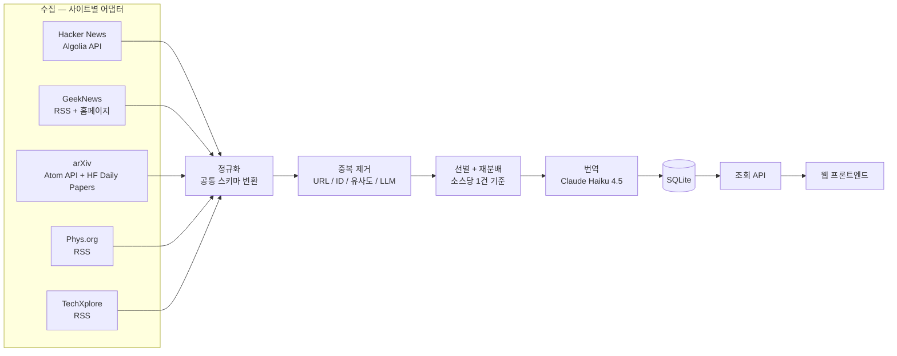

# (가칭) 데일리 테크·사이언스 다이제스트 — 기술 백서 (Technical Whitepaper)

| | |
|---|---|
| 프로젝트 | (가칭) 데일리 테크·사이언스 다이제스트 — 해외/국내 5개 소스 한국어 큐레이션 |
| 문서 버전 | v0.1 (draft) |
| 상태 | 소스별 접근 방식 조사 완료, 선별·중복제거·번역·저장 파이프라인 설계 초안 |
| 범위 | Hacker News · GeekNews · arXiv · Phys.org · TechXplore, 소스당 1건/일(재분배 규칙 포함) 수집 후 한국어 변환·게시 |
| 비범위(현 단계) | 프론트엔드 UI/UX 상세(별도 DESIGN_WHITEPAPER 권장), 뉴스레터/알림 채널, 다국어 확장, HARNESS 팩 |

---

## 0. 설계 전제

프로젝트의 핵심 난이도는 소스가 이질적이라는 점에 있다. 5개 소스는 콘텐츠 성격(UGC 투표형 / 학술 API / 편집형 저널리즘), 접근 수단(공식 API / RSS / 비공식), 언어(영어 4 + 한국어 1), 갱신 패턴(매일 / 주중만)이 전부 다르다. 이 문서의 모든 설계는 이 이질성을 흡수하는 공통 어댑터 인터페이스를 축으로 한다.

**"오늘" 정의.** 소스별 타임존이 제각각(미국 동부 3곳, 한국 1곳, 국제 1곳)이라 특정 시간대의 캘린더 일(day) 경계를 억지로 맞추지 않는다. 대신 배치 실행 시점 기준 **직전 24시간(rolling 24h)** 을 수집 창으로 정의한다. 배치는 매일 1회 09:00 KST(=00:00 UTC) 실행을 기본값으로 제안한다 — 미국 소스의 전날 낮~저녁 활동과 GeekNews의 새벽 누적분이 함께 창에 들어오는 시간대다.

**"최신 + 인기" 결합 기준.** 단순 최신순이 아니라 "수집 창 내 게시 항목 중 인기 신호 상위"를 뽑는다. 인기 신호는 소스마다 성격이 달라 아래처럼 고정한다.

| 소스 | 최신 판정 | 인기 신호 | 인기 신호 부재 시 대체 |
|---|---|---|---|
| Hacker News | 수집 창 내 게시 | points + 댓글수 (Algolia relevance) | 해당 없음(항상 존재) |
| GeekNews | 수집 창 내 게시 | 홈페이지 투표 순위 | RSS 게시 순서 |
| arXiv | 수집 창 내 submittedDate | Hugging Face Daily Papers 업보트 | 카테고리 내 최신순 |
| Phys.org | 수집 창 내 게시 | Spotlight 피드 포함 여부 | 전체 피드 상위 N건 |
| TechXplore | 수집 창 내 게시 | Spotlight 피드 포함 여부(추정) | 전체 피드 상위 N건 |

**재분배 규칙(요건 그대로 반영).** 특정 소스가 수집 창 내 후보 0건이면 해당 슬롯을 비우고, 그날 후보 2건 이상인 소스에서 순위 하위로 추가 선정해 채운다. 단일 소스가 하루 3건을 넘지 않도록 상한을 둔다(편중 방지). 전체 소스가 동시에 0건인 날이 없다고 가정하지 않는다 — 극단적으로 총량이 5건 미만인 날은 정상 동작으로 허용한다.

arXiv는 미국 동부시간 기준 일~목요일만 신규 발표하며 **금·토요일엔 아나운스가 없다**(KST로는 대략 토·일요일과 겹침). 재분배 규칙이 실제로 발동하는 가장 빈번한 케이스로 예상된다.

**번역 대상의 예외.** GeekNews 게시물은 사용자가 직접 작성한 한국어 요약을 이미 포함하는 경우가 많다(원문은 영어여도 GeekNews 상 텍스트는 한국어). 이 경우 "번역"이 아니라 맞춤법·표기 정제만 수행한다. 나머지 4개 소스는 원문이 전부 영어이므로 정식 번역 대상이다.

**비범위.** 이 문서는 데이터 파이프라인·백엔드 아키텍처에 집중한다. 화면 설계·인터랙션 디테일은 기존 워크플로 관례대로 별도 DESIGN_WHITEPAPER.md에서 다룰 것을 권장한다.

---

## 1. 전체 파이프라인



각 단계는 독립 실행 가능한 순수 함수에 가깝게 설계한다 — 특정 소스 어댑터가 실패해도 나머지 파이프라인은 계속 진행되어야 한다(§9 리스크 참조).

---

## 2. 사이트별 데이터 수집 전략

### 2.1 요약

| 소스 | 접근 방식 | 인증 | 공식성 | 상업적 이용 |
|---|---|---|---|---|
| Hacker News | Algolia HN Search API | 불필요 | Algolia 운영, HN 데이터 공식 미러 | 명시적 제한 조항 확인 안 됨 |
| GeekNews | RSS(news.hada.io/rss/news) + 홈페이지 | 불필요 | RSS는 공식 제공 기능 | 불명확 — 대량 이용 시 사전 문의 권장 |
| arXiv | Atom API(export.arxiv.org) | 불필요 | 공식 | 메타데이터/초록 수준 통상 허용, 본문은 저자 라이선스 별도 |
| Phys.org | RSS(전체 + Spotlight) | 불필요 | 공식, 상업적 이용 명시 허용 | **허용**(헤드라인 변경 금지, 출처 표기 의무) |
| TechXplore | RSS(전체 + Spotlight 추정) | 불필요 | 공식, Phys.org와 동일 정책 | **허용**(동일 조건) |

### 2.2 Hacker News

Algolia가 운영하는 HN 검색 API를 사용한다. 인증 불필요, 별도 공지된 rate limit 없음(과도한 병렬 호출만 자제).

```javascript
// 수집 창(최근 24h) 내 스토리, 인기순(Algolia relevance = points+댓글 가중)
const since = Math.floor((Date.now() - 24 * 3600 * 1000) / 1000);
const url = `https://hn.algolia.com/api/v1/search?tags=story&numericFilters=created_at_i>${since}&hitsPerPage=30`;
const { hits } = await (await fetch(url)).json();
// hits[0]가 인기 1순위 후보. 필드: objectID, title, url, points, num_comments, created_at
```

`search_by_date`(시간순)와 `search`(관련도순 — query 없이 tags+numericFilters만 넣으면 사실상 points 랭킹)를 구분해서 쓴다. 이 프로젝트는 후자만으로 "최신+인기"가 한 번에 해결된다.

### 2.3 GeekNews

정식 API는 없으나 공식 RSS를 제공한다. RSS는 **시간순(최신)** 이며, 사이트 스스로 "홈페이지는 투표로 순위가 바뀌므로 RSS와 다를 수 있다"고 명시한다 — 즉 인기 신호는 RSS에 없다.

```javascript
// 최신 후보 — 공식 RSS
const xml = await (await fetch('https://news.hada.io/rss/news')).text();
// rss-parser 등으로 title/link/pubDate/description 파싱, 24h 창으로 필터

// 인기 보정 — 홈페이지(news.hada.io) 경량 스크레이핑
// 로그인 없이 열람 가능한 공개 페이지. robots.txt 확인 후
// 요청 간격 최소 수 초, User-Agent 명시, 캐싱으로 재요청 최소화
```

GeekNews는 2019년부터 매일 빠짐없이 갱신되므로 이 소스가 재분배 트리거가 될 가능성은 낮다. 운영사(하다 스튜디오)가 제휴 문의에 열려 있다고 명시하므로 대량/상업적 이용 시 contact@hada.io로 사전 협의를 권장한다.

GeekNews 게시물 중 상당수가 원래 HN 등 해외 소스를 인용한다 — 이 프로젝트에서 **HN↔GeekNews 중복이 가장 빈번한 케이스**로 예상된다(§3.2).

### 2.4 arXiv

공식 Atom API. 카테고리 필터로 관심 분야를 좁힌다 — JTechpedia의 AI/엔지니어링 성향에 맞춰 cs.AI/cs.LG/cs.CL/cs.RO 등을 기본값으로 제안한다(조정 가능).

```javascript
// 최신 후보
const cats = 'cat:cs.AI+OR+cat:cs.LG+OR+cat:cs.CL+OR+cat:cs.RO+OR+cat:cs.CV';
const url = `http://export.arxiv.org/api/query?search_query=${cats}&sortBy=submittedDate&sortOrder=descending&max_results=50`;
// User-Agent 헤더 필수, 요청 간 최소 3초 간격 (429 발생 시 지수 백오프 — §9)

// 인기 후보 — Hugging Face Daily Papers (arXiv 논문에 대한 커뮤니티 업보트)
const hf = await fetch(`https://huggingface.co/api/daily_papers?date=${todayISO}&limit=20`);
```

HF Daily Papers는 비공식 문서화 상태이지만 huggingface.co/papers 화면이 실제로 쓰는 API다. 다만 AI/ML 논문 위주로 큐레이션되므로, 이 프로젝트의 arXiv "인기" 정의를 의도적으로 AI/ML 카테고리에 한정하는 것으로 간주한다(물리·수학 등 타 분야는 "최신"만 적용).

arXiv는 미국 동부시간 일~목요일만 신규 발표한다. 금·토(KST 토·일 부근) 창에는 후보가 0건일 수 있으며, §0의 재분배 규칙이 이 경우를 흡수한다.

### 2.5 Phys.org

공식 RSS. **개인·상업적 이용 모두 무료로 명시 허용**되며, 조건은 헤드라인/링크 변경 금지와 출처 표기 의무뿐이다(phys.org/feeds/ 자체 약관 확인).

```javascript
// 최신 — 전체 기사 피드
const all = await fetch('https://phys.org/rss-feed/');
// 인기/주목 — 에디터 선별 Spotlight 피드
const spotlight = await fetch('https://phys.org/rss-feed/spotlight/');
// ↑ 슬러그 추정치. 정확한 URL은 구현 시 phys.org/feeds/ 페이지에서 재확인 필요
```

Spotlight 피드는 Phys.org가 편집자 판단으로 선별하는 "주목 기사" 트랙이다 — 사용자 투표가 없는 저널리즘 매체에서 이 프로젝트의 "인기" 정의로 가장 적합한 대안 신호다.

### 2.6 TechXplore

Phys.org와 동일한 Science X 네트워크. RSS 정책과 상업적 이용 허용 조건이 동일하게 명시되어 있다(techxplore.com/feeds/ 확인).

```javascript
const all = await fetch('https://techxplore.com/rss-feed/');
const spotlight = await fetch('https://techxplore.com/rss-feed/spotlight/'); // 존재 여부·슬러그 구현 시 재확인
```

machine-learning-ai-news, robotics-news, engineering-news 등 세부 주제 피드도 제공되므로, 추후 카테고리 필터링 기능을 얹을 때 활용 가능하다.

---

## 3. 선별 · 중복 제거 · 재분배

### 3.1 후보 공통 스키마

```javascript
const Candidate = {
  source: 'hackernews',        // hackernews | geeknews | arxiv | physorg | techxplore
  sourceItemId: '42xxxxx',
  title: '...',
  url: '...',                  // 외부 원문 링크(HN/GeekNews) 또는 자체 기사·초록 URL
  summary: '...',              // RSS description 또는 arXiv abstract
  publishedAt: '2026-07-04T02:00:00Z',
  popularitySignal: 812,       // points 등, 없으면 null
  isPopularPick: true,         // §0 표 기준 인기 트랙 포함 여부
};
```

### 3.2 중복 제거 — 우선순위 4단계

```javascript
function findDuplicate(candidate, alreadyPicked) {
  for (const picked of alreadyPicked) {
    // 1차: 외부 링크 정확 일치(정규화 후) — HN↔GeekNews 케이스에 가장 유효
    if (normalizeUrl(candidate.url) === normalizeUrl(picked.url)) return picked;

    // 2차: arXiv ID 일치 — arXiv 자체 중복에 한정(타 소스는 보통 ID 미기재)
    const a = extractArxivId(candidate.url), b = extractArxivId(picked.url);
    if (a && b && a === b) return picked;

    // 3차: 정규화 제목 유사도(자카드)
    const sim = jaccardSimilarity(normalizeTitle(candidate.title), normalizeTitle(picked.title));
    if (sim >= 0.6) return picked;
    if (sim >= 0.3) candidate._ambiguousWith = picked;  // 4차로 이관
  }
  return null;
}
```

4차(애매 구간 0.3~0.6)는 Claude Haiku 4.5로 "같은 소식인지" 이진 분류한다 — 건당 수백 토큰 수준이라 비용은 무시할 만하다(§4.2). arXiv 논문이 Phys.org/TechXplore 기사로 다뤄지는 경우는 기사 본문에 arXiv ID가 잘 남지 않으므로 1·2차로 못 잡고 3·4차에 의존하는 케이스로 예상해야 한다.

### 3.3 선별 및 재분배

```javascript
function selectDaily(candidatesBySource) {
  const sortedPools = {};   // source -> 중복 제거·정렬된 전체 후보
  const picks = {};
  const deficits = [];

  for (const source of SOURCES) {
    sortedPools[source] = candidatesBySource[source]
      .filter(c => !findDuplicate(c, Object.values(picks).flat()))
      .sort(byPopularityThenRecency);
    if (sortedPools[source].length > 0) {
      picks[source] = [sortedPools[source][0]];
    } else {
      picks[source] = [];
      deficits.push(source);
    }
  }

  // 재분배: 후보 2건 이상 남은 소스에서 순위 하위로 보충 (소스당 최대 3건)
  let remaining = deficits.length;
  const donors = SOURCES
    .filter(s => !deficits.includes(s))
    .map(s => ({ source: s, pool: sortedPools[s].slice(1) }))  // 이미 뽑힌 1건 제외
    .filter(d => d.pool.length > 0)
    .sort((a, b) => b.pool.length - a.pool.length);

  for (const donor of donors) {
    while (remaining > 0 && donor.pool.length > 0 && picks[donor.source].length < 3) {
      const next = donor.pool.shift();
      if (!findDuplicate(next, Object.values(picks).flat())) {
        picks[donor.source].push(next);
        remaining--;
      }
    }
    if (remaining === 0) break;
  }

  return picks;  // remaining > 0로 끝나면 그날 총량이 5건 미만 — 정상 동작
}
```

---

## 4. 번역 파이프라인

### 4.1 원칙

전문 스크래핑·재게시는 하지 않는다. **제목 + 요약(초록/RSS description)만 번역**하고 원문 링크를 항상 노출한다. 이는 §8 법적 검토와 직결된 설계 결정이며, Phys.org/TechXplore 약관이 명시적으로 요구하는 "링크·출처 유지" 조건과도 부합한다.

GeekNews 항목은 §0에서 정의한 대로 번역이 아니라 정제만 수행한다.

### 4.2 모델 및 비용

Claude Haiku 4.5(`claude-haiku-4-5-20251001`, $1/$5 per MTok)로 충분하다. 항목당 입력 약 300토큰·출력 약 400토큰으로 잡으면, 하루 8건(재분배 포함 평균치) 기준 월 비용은 1달러 미만이다. 배치 API(50% 할인)는 이 규모에서는 실익이 크지 않아 실시간 Messages API로 충분하다.

```javascript
const res = await fetch('https://api.anthropic.com/v1/messages', {
  method: 'POST',
  headers: { 'x-api-key': API_KEY, 'anthropic-version': '2023-06-01', 'content-type': 'application/json' },
  body: JSON.stringify({
    model: 'claude-haiku-4-5-20251001',
    max_tokens: 600,
    system: '기술/과학 뉴스 번역가. 사실관계를 왜곡하지 않는 자연스러운 한국어로 번역. ' +
            '출력은 JSON만: {"title_ko": "...", "summary_ko": "..."}',
    messages: [{ role: 'user', content: `제목: ${item.title}\n요약: ${item.summary}` }],
  }),
});
```

고유명사·전문용어 오역 방지를 위해 자주 등장하는 용어(모델명, 회사명, 학술 용어)의 사전을 시스템 프롬프트에 점진적으로 누적하는 것을 권장한다(Schema-Hub의 Science_Encyclopedia/Econ_Decoder 스킬 자산 재사용 가능).

---

## 5. 데이터 스키마

```sql
CREATE TABLE daily_picks (
  id INTEGER PRIMARY KEY AUTOINCREMENT,
  pick_date TEXT NOT NULL,          -- 배치 실행일(KST, 'YYYY-MM-DD')
  source TEXT NOT NULL,             -- hackernews | geeknews | arxiv | physorg | techxplore
  source_item_id TEXT NOT NULL,
  title_original TEXT NOT NULL,
  title_ko TEXT NOT NULL,
  summary_original TEXT,
  summary_ko TEXT,
  url TEXT NOT NULL,
  popularity_signal INTEGER,        -- points/upvotes 등 (없으면 NULL)
  published_at TEXT,
  selection_reason TEXT NOT NULL,   -- primary | redistributed
  is_translated INTEGER NOT NULL,   -- GeekNews 정제-only 항목은 0
  created_at TEXT DEFAULT (datetime('now')),
  UNIQUE(source, source_item_id)
);

CREATE TABLE dedup_log (
  id INTEGER PRIMARY KEY AUTOINCREMENT,
  pick_date TEXT NOT NULL,
  kept_source TEXT NOT NULL,
  kept_item_id TEXT NOT NULL,
  dropped_source TEXT NOT NULL,
  dropped_title TEXT NOT NULL,
  method TEXT NOT NULL,             -- url | arxiv_id | jaccard | llm
  similarity_score REAL
);
```

단일 사용자·일 5~8건 규모에는 SQLite 단일 파일로 충분하다(CommentVault와 동일 패턴). 마이그레이션은 스크립트로 관리한다.

---

## 6. 스케줄링 및 자동화

기존 스톡 분석 파이프라인과 동일하게 GitHub Actions cron을 제안한다.

```yaml
on:
  schedule:
    - cron: '0 0 * * *'   # 09:00 KST
  workflow_dispatch: {}    # 수동 재실행용
```

실행 순서: 수집(5개 어댑터 병렬) → 정규화 → 중복 제거 → 선별/재분배 → 번역 → SQLite 적재 → (정적 사이트 재빌드 또는 API 캐시 무효화). 개별 어댑터 실패는 해당 소스만 스킵하고 나머지로 계속 진행한다(§9).

---

## 7. 프론트엔드 개요 (간략)

이 문서는 파이프라인에 집중하며, 화면 설계는 별도 DESIGN_WHITEPAPER.md를 권장한다. 최소 요구사항만 명시한다.

- 날짜별 아카이브 뷰(최근 날짜 기본 표시)
- 소스별 배지 + 원문 링크(신규 탭)
- 인기 신호 노출(points 등, 없으면 "에디터 선정"으로 대체 표기)
- Phys.org/TechXplore 항목은 출처 표기 필수(약관 조건)

---

## 8. 법적·저작권 고려사항

*본 절은 법률 자문이 아니다. 실제 운영 전 각 사이트의 최신 약관을 직접 재확인할 것을 권장한다.*

| 소스 | 확인된 조건 | 권장 처리 |
|---|---|---|
| Phys.org / TechXplore | RSS 개인·상업적 이용 명시 허용. 헤드라인/링크 변경 금지, 출처 표기 의무(공식 약관 확인됨) | 요약 번역 + 원문 링크 + "출처: Phys.org/TechXplore" 고정 표기 |
| Hacker News | Algolia API 약관상 명확한 상업적 제한 확인 안 됨 | 원문 링크 필수 노출, 대량 트래픽 유발 시 정중한 크레딧 |
| GeekNews | 정식 API 없음(RSS는 공식 기능). UGC 특성상 요약문 자체에 작성자 권리 존재 가능 | 링크 + 짧은 발췌 원칙, 상업적 대량 이용 시 hada.io에 사전 문의(contact@hada.io) |
| arXiv | 메타데이터/초록 API 이용은 통상 허용. 본문은 저자 지정 라이선스 별도 | 초록 수준까지만 번역, 본문 전재 금지, User-Agent 명시·요청 간격 준수 |

공통 원칙: **전문 재게시 금지 · 요약 기반 번역 · 원문 링크 상시 노출 · 출처 표기 통일 포맷**. 법적 리스크 완화와 동시에 각 소스의 실제 트래픽을 뺏지 않는다는 점에서 지속가능성 측면에서도 유리하다.

---

## 9. 리스크 및 완화

| 리스크 | 영향 | 완화 방안 |
|---|---|---|
| arXiv API 간헐적 429(2026년 초 커뮤니티 다수 보고) | 해당 배치의 arXiv 수집 실패 | 지수 백오프 재시도, 최종 실패 시 HF Daily Papers만으로 대체 |
| GeekNews 홈페이지 구조 변경 | 인기 스크레이핑 셀렉터 파손 | 셀렉터 모듈화 + 실패 시 RSS 게시 순서로 자동 폴백 |
| Phys.org/TechXplore Spotlight 피드 슬러그 상이 | 인기 신호 상실 | 구현 초기 phys.org/feeds/ 직접 확인, 정기 헬스체크, 실패 시 전체 피드 상위 N건 폴백 |
| 소스 간 중복 오탐/미탐 | 같은 소식 중복 노출 또는 과잉 필터링 | 유사도 임계값 튜닝 + LLM 보정 + dedup_log 수동 검수 |
| 번역 오역(고유명사·전문용어) | 신뢰도 저하 | 용어 사전 프롬프트 주입, 오역 패턴 로그화·누적 |
| GeekNews 등 ToS 불명확 소스의 상업적 재배포 리스크 | 게시 중단 요청 가능성 | 링크+짧은 요약 원칙 고수, 출처 측 요청 시 즉시 대응 프로세스 마련 |

---

## 10. 구현 로드맵

| Phase | 범위 | 완료 기준(DoD 성격) |
|---|---|---|
| M0 | HN 어댑터 단독 PoC | latest+popular 후보 fetch, 공통 스키마 변환 성공 |
| M1 | 5개 소스 어댑터 전체 | 소스별 latest/popular 후보 정상 수집, 스키마 확정 |
| M2 | 중복 제거 + 재분배 | 4단계 dedup 통과, 인위적 중복 케이스 테스트셋 검증 |
| M3 | 번역 파이프라인 | Haiku 연동, JSON 파싱 실패율 측정 |
| M4 | 스케줄링/저장 | GitHub Actions 자동 실행, SQLite 적재 확인 |
| M5 | 프론트엔드 최소 뷰 | 날짜별 아카이브 노출 |
| M6 | 모니터링/폴백 검증 | Spotlight 슬러그 등 §9 리스크 항목 실측 재확인 |

---

## 부록 A. 초기 디렉토리 구조 제안

```
daily-digest/
├── src/
│   ├── adapters/
│   │   ├── hackernews.mjs
│   │   ├── geeknews.mjs
│   │   ├── arxiv.mjs
│   │   ├── physorg.mjs
│   │   └── techxplore.mjs
│   ├── pipeline/
│   │   ├── normalize.mjs
│   │   ├── dedup.mjs
│   │   ├── select.mjs
│   │   └── translate.mjs
│   ├── db/
│   │   ├── schema.sql
│   │   └── index.mjs
│   └── index.mjs
├── .github/workflows/daily.yml
└── package.json
```

이 구조는 다음 단계(HARNESS.md / Schema-Hub Pack 인스턴스화)로 그대로 넘길 수 있는 수준으로 잡았다.
